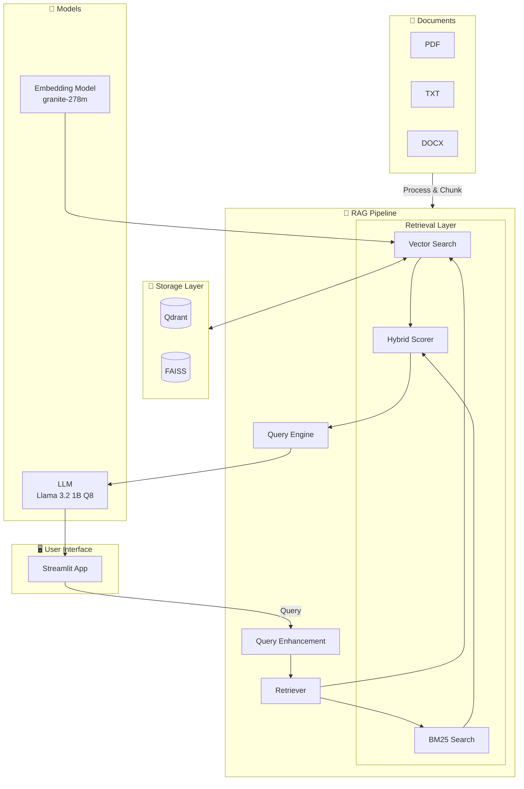

# On-Device RAG

> **Experimental Retrieval-Augmented Generation for Resource-Constrained Devices**

A lightweight, CPU-only RAG system designed for deployment on edge devices, laptops, and air-gapped environments. Enables local LLM inference with advanced retrieval techniques, all within a Dockerized setup for cross-platform compatibility.

---

## ⚠️ Project Status

**This is an experimental, research-oriented project.** It is not production-ready software.

- Created for learning, experimentation, and academic use
- Optimized for constrained hardware (≤4 CPU cores, ≤6GB RAM)

---

## 🎯 What This Project Is

On-Device RAG is a personal project built entirely on open-source components, that demonstrates how to build a complete RAG pipeline that runs locally on modest hardware.

### Key Capabilities

| Feature                   | Description                                                                             |
|---------------------------|-----------------------------------------------------------------------------------------|
| **Offline Operation**     | No internet required after initial model download                                       |
| **Multi-linguality**      | Supported languages: English, Italian, German, French, Portuguese, Hindi, Spanish, Thai |
| **CPU-Only Inference**    | Runs on laptops without dedicated GPUs                                                  |
| **Hierarchical Chunking** | Small chunks for retrieval, large chunks for context                                    |
| **Hybrid Search**         | Combines vector similarity with BM25 keyword matching                                   |
| **Conversational Memory** | Maintains context across multi-turn conversations                                       |
| **Docker Deployment**     | Consistent environment across platforms                                                 |

---

## 🏗️ Architecture



### Component Overview

| Component | Purpose | Location |
|-----------|---------|----------|
| **Core** | Chunking, embedding, LLM, retrieval | `core/` |
| **Storage** | Vector store abstraction (Qdrant/FAISS) | `storage/` |
| **Document Management** | Upload, process, index documents | `document_management/` |
| **Memory** | Conversational context management | `memory/` |
| **Monitoring** | Prometheus metrics, logging | `monitoring/` |
| **UI** | Streamlit chat interface | `ui/` |

---

## 📁 Project Structure

```
on-device-rag/
├── app.py                      # Main Streamlit application
├── config/
│   └── settings.py             # Pydantic-based configuration
├── core/
│   ├── chunking.py             # Hierarchical/simple chunking
│   ├── embeddings.py           # Embedding model management
│   ├── llm.py                  # LLM initialization (LlamaCPP)
│   └── retrieval.py            # Hybrid retrieval (vector + BM25)
├── storage/
│   ├── vector_store.py         # Abstract interface
│   ├── qdrant_store.py         # Qdrant implementation
│   └── local_store.py          # FAISS implementation
├── document_management/
│   ├── processor.py            # Document loading & preprocessing
│   ├── indexer.py              # Document indexing logic
│   └── uploader.py             # File upload handling
├── memory/
│   └── conversation.py         # Sliding-window conversation memory
├── citation/
│   └── extractor.py            # Citation extraction & formatting
├── monitoring/
│   ├── metrics.py              # Prometheus metrics
│   ├── logger.py               # Structured JSON logging
│   └── dashboard.py            # Performance dashboard
├── ui/
│   ├── chat.py                 # Chat interface components
│   ├── sidebar.py              # Sidebar with stats
│   └── document_viewer.py      # Document management UI
├── tests/
│   ├── test_chunking.py        # Chunking tests
│   ├── test_retrieval.py       # Retrieval tests
│   └── test_vector_store.py    # Vector store tests
├── data/                       # Your documents go here
├── models/                     # GGUF model files
├── embeddings/                 # Cached embedding models
├── docker-compose.yml          # Container orchestration
├── Dockerfile                  # Application container
└── requirements.txt            # Python dependencies
```

---

## 🚀 Quick Start

### Prerequisites

- **Docker Desktop** (v20.10+)
- **8GB+ RAM** (6GB for containers, 2GB for system)
- **20GB disk space** (docker image + models + indices)

### 1. Clone & Setup

```bash
git clone https://github.com/your-username/on-device-rag.git
cd on-device-rag
```

### 2. Download Models

Download a GGUF model and place it in `models/`:

```bash
# Example: Llama 3.2 1B Instruct (Q8 quantization)
# Download from HuggingFace and save as:
# models/llama-3.2-1b-instruct-q8_0.gguf
```

The embedding model (`ibm-granite/granite-embedding-278m-multilingual`) downloads automatically on first run.

### 3. Add Documents

Place your documents in the `data/` directory:

```bash
cp /path/to/your/documents/*.pdf data/
```

Supported formats: PDF, TXT, DOCX, MD

### 4. Start the Application

```bash
docker compose up --build
```

Wait for initialization (~10-15 minutes on first run), then open:

- **Chat UI**: http://localhost:8501
- **Qdrant Dashboard**: http://localhost:6333/dashboard
- **Metrics**: http://localhost:8001/metrics

### 5. Stop the Application

```bash
docker compose down
```

---

## 🐳 Docker Usage

This section provides comprehensive Docker commands for managing the application.

> If you're new to Docker, `docker compose up --build` is usually all you need.


### Building & Starting

```bash
# Build and start all containers (first time, or after dependency/Dockerfile changes)
docker compose up --build

# Start without rebuilding (faster, uses cached images)
docker compose up

# Start in detached mode (run in background)
docker compose up -d

# Start only the RAG application (without Qdrant)
docker compose up rag-app

# Force rebuild without cache
docker compose build --no-cache
docker compose up
```

### Stopping & Cleanup

```bash
# Stop all containers (preserves data volumes)
docker compose down

# Stop and remove volumes (WARNING: deletes indexed data)
docker compose down -v

# Stop a specific service
docker compose stop rag-app

# Remove stopped containers
docker compose rm
```

### Logs & Debugging

```bash
# View logs from all services
docker compose logs

# Follow logs in real-time
docker compose logs -f

# View logs for a specific service
docker compose logs rag-app
docker compose logs qdrant

# View last 100 lines of logs
docker compose logs --tail=100
```

### Running Commands Inside Containers

```bash
# Open a shell inside the running RAG container
docker compose exec rag-app bash

# Run tests inside the container
docker compose exec rag-app pytest tests/ -v

# Check Python environment
docker compose exec rag-app pip list

# Run a one-off command
docker compose run --rm rag-app python -c "from config import settings; print(settings)"
```

### Container Management

```bash
# List running containers
docker compose ps

# Restart a specific service
docker compose restart rag-app

# View resource usage
docker stats

# Inspect container details
docker compose inspect rag-app
```

---

## 📦 Locking the Python Environment

To improve reproducibility, you can store the exact versions of all installed Python dependencies in a `requirements.lock` file.

> **Note:**
> requirements.txt defines the intended dependencies, while requirements.lock records the resolved environment at a specific point in time.
> The lock file is optional but recommended for experiments and long-term reproducibility.

### Generate `requirements.lock`

From inside the running environment (recommended):

```bash
# Inside the Docker container
docker compose exec rag-app pip freeze > requirements.lock
```

Or when running locally without Docker:

```bash
pip freeze > requirements.lock
```

This captures the exact dependency versions currently in use.

### Recreate the Environment from the `.lock` File
```bash
pip install -r requirements.lock
```

---

## 📊 Memory Profiling

The application includes built-in memory profiling to help monitoring the performance on resource-constrained devices.

### What Profiling Provides

Memory profiling tracks:

- **RSS (Resident Set Size)**: Physical memory currently used by the process
- **VMS (Virtual Memory Size)**: Total virtual memory allocated
- **Memory percentage**: Proportion of system memory used
- **Automatic cleanup triggers**: When memory exceeds configured thresholds

### Enabling Memory Profiling

Set the environment variable in your `.env` file or docker-compose:

```bash
# In .env file
ENABLE_MEMORY_PROFILING=true

# Or via command line
docker compose run -e ENABLE_MEMORY_PROFILING=true rag-app
```

### Profiling Configuration

| Variable | Default | Description |
|----------|---------|-------------|
| `ENABLE_MEMORY_PROFILING` | `false` | Show memory stats in UI |
| `AUTO_CLEANUP_THRESHOLD_MB` | `5000` | Trigger GC when RSS exceeds this |

---

## 🔧 RAG Pipeline Details

### Document Processing Flow

```
Document → Load → Preprocess → Chunk → Embed → Store
```

1. **Load**: SimpleDirectoryReader handles PDF, TXT, DOCX, MD
2. **Preprocess**: Text cleaning, whitespace normalization
3. **Chunk**: Split into retrievable units (hierarchical or flat)
4. **Embed**: Convert to vectors using `granite-278m`
5. **Store**: Persist in Qdrant or FAISS

### Hierarchical Chunking

When enabled, documents are split into two levels:

- **Parent chunks** (~1200 tokens): Provide context to the LLM
- **Child chunks** (~400 tokens): Indexed for precise retrieval

On retrieval, child chunks are matched, but the corresponding parent chunk is passed to the LLM for richer context.

### Hybrid Retrieval

Combines two retrieval strategies:

1. **Vector Search**: Semantic similarity using embeddings
2. **BM25**: Keyword-based matching

Final score: `α × vector_score + (1-α) × bm25_score`

Use `HYBRID_ALPHA` to balance semantic vs. keyword matching.

---

## 🧪 Testing

Run the test suite:

```bash
# Inside the container
docker compose exec rag-app pytest tests/ -v

# Or locally (requires dependencies installed)
pytest tests/ -v
```

Tests cover:

- Chunking logic (hierarchical and simple)
- Retrieval (hybrid and vector-only)
- Vector store interface

---

## 🛠️ Development

### Local Development (without Docker)

```bash
# Create virtual environment
python -m venv .venv
source .venv/bin/activate  # or .venv\Scripts\activate on Windows

# Install dependencies
pip install -r requirements.txt

# Install llama-cpp-python with CPU optimizations
CMAKE_ARGS="-DGGML_BLAS=ON" pip install llama-cpp-python

# Run the app
streamlit run app.py
```

---

## 🗺️ Roadmap

> **Note**: This is an experimental project. These items are aspirational.

### Planned

- [ ] Optimizations to reduce inference time and TTFT
- [ ] Query caching to reduce inference time for repeated questions
- [ ] Reranking to improve precision on ambiguous queries
- [ ] Better citation extraction

### Under Consideration

- [ ] Multi-modal support (images)
- [ ] Knowledge graph integration
- [ ] Fine-tuning support
- [ ] WebUI improvements
- [ ] Support for additional embedding/LLM models

---

## 🤝 Contributing

Contributions are welcome! This is a learning project, so:

1. **Issues**: Bug reports, questions, and suggestions are all helpful
2. **Pull Requests**: Keep them focused and well-documented
3. **Discussions**: Share your experiments and use cases
4. **Fork**: Feel free to fork and adapt for your own needs

Please note:

- This is a personal project with limited maintenance bandwidth
- Performance improvements are especially welcome

---

## 📜 License

This project is licensed under the MIT License. See [LICENSE](LICENSE) for details.

---

## 🙏 Acknowledgments

Built with:

- [LlamaIndex](https://www.llamaindex.ai/) - RAG orchestration
- [Qdrant](https://qdrant.tech/) - Vector database
- [llama.cpp](https://github.com/ggerganov/llama.cpp) - CPU inference
- [Streamlit](https://streamlit.io/) - UI framework
- [IBM Granite](https://huggingface.co/ibm-granite) - Embedding model
- [Quantized LLama 3](https://huggingface.co/hugging-quants/Llama-3.2-1B-Instruct-Q8_0-GGUF) - Lightweight LLM
- [Prometheus](https://prometheus.io/) - Monitoring
- [Grafana](https://grafana.com/) - Dashboard

